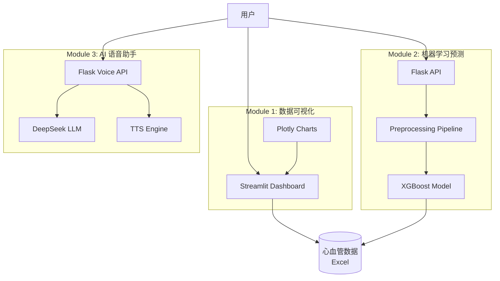

# CardioAI - 心血管疾病智能辅助系统

<div align="center">

**一个集成数据可视化、机器学习预测和 AI 语音问答的综合性心血管健康智能辅助平台**

[](https://www.python.org/)
[](LICENSE)
[](https://streamlit.io/)
[](https://flask.palletsprojects.com/)

</div>

---

## 📋 目录

- [项目简介](#项目简介)
- [核心功能](#核心功能)
- [技术架构](#技术架构)
- [快速开始](#快速开始)
- [使用指南](#使用指南)
- [项目结构](#项目结构)
- [配置说明](#配置说明)
- [技术栈](#技术栈)
- [常见问题](#常见问题)
- [贡献指南](#贡献指南)
- [许可证](#许可证)
- [作者信息](#作者信息)

---

## 🎯 项目简介

CardioAI 是一个功能完整的心血管疾病智能辅助系统，旨在通过数据分析、机器学习和人工智能技术，为医疗工作者和普通用户提供心血管健康评估、风险预测和智能问答服务。

### ✨ 核心特性

- 📊 **交互式数据可视化** - 基于 Streamlit 的动态仪表板，多维度展示心血管数据
- 🤖 **智能风险预测** - XGBoost 机器学习模型，准确预测心血管疾病风险
- 🎙️ **AI 语音助手** - 集成 DeepSeek LLM 和语音合成，提供专业健康咨询
- 🔒 **隐私保护** - 支持离线模式，数据本地处理
- 🚀 **易于部署** - 模块化设计，可独立运行或集成使用

---

## 🚀 核心功能

### Module 1: 数据可视化仪表板

基于 **Streamlit** 和 **Plotly** 构建的交互式数据分析平台。

**主要功能：**
- 心血管数据自动加载与清洗
- 特征工程（年龄转换、BMI 计算、异常值处理）
- 多维度数据筛选（年龄、性别、疾病状态）
- 交互式图表（年龄分布、BMI 类别、疾病关联分析）
- 实时统计指标展示

**详细文档：** [module1_dashboard/README.md](module1_dashboard/README.md)

**快速启动：**
```bash
streamlit run module1_dashboard/cardio_dashboard.py
```

---

### Module 2: 机器学习风险预测

基于 **XGBoost** 的心血管疾病风险预测 API。

**主要功能：**
- XGBoost 梯度提升分类器
- 完整的数据预处理 Pipeline（标准化、编码）
- RESTful API 接口（Flask）
- Web 前端界面（HTML/JavaScript）
- 模型训练与保存

**详细文档：** [module2_predictor/README.md](module2_predictor/README.md)

**快速启动：**
```bash
# 训练模型
python module2_predictor/train_and_save.py

# 启动 API 服务
python module2_predictor/app.py
# 访问 http://localhost:5000
```

---

### Module 3: AI 语音健康顾问

集成 **DeepSeek LLM** 和 **TTS 语音合成**的智能问答系统。

**主要功能：**
- 专业心血管健康问答（DeepSeek LLM）
- 文字转语音（CosyVoice / pyttsx3）
- 双模式支持（在线 API / 离线模拟）
- Web 交互界面，自动播放语音
- 基于 Base64 的音频传输

**详细文档：** [module3_voice_assistant/README.md](module3_voice_assistant/README.md)

**快速启动：**
```bash
python module3_voice_assistant/voice_assistant_app.py
# 访问 http://localhost:5001
```

---

## 🏗️ 技术架构



---

## 🚀 快速开始

### 环境要求

- **Python**: 3.10 或更高版本
- **Conda**: 推荐使用 Anaconda/Miniconda
- **Git**: 用于克隆代码仓库
- **操作系统**: Windows / macOS / Linux

### 安装步骤

#### 1. 克隆仓库

```bash
git clone git@github.com:888jh/CardioAI.git
cd CardioAI
```

#### 2. 创建虚拟环境

```bash
# 使用 Conda 创建环境（推荐）
conda create -n cardioenv python=3.10
conda activate cardioenv
```

#### 3. 安装依赖

```bash
pip install -r requirements.txt
```

#### 4. 配置环境变量

```bash
# 复制环境变量模板（如果需要）
# cp .env.example .env

# 编辑 .env 文件，配置 API Keys
# 对于 Module 3，如果使用模拟模式，可以跳过 API 配置
```

#### 5. 准备数据

确保 `data/心血管疾病.xlsx` 文件存在。

---

## 📖 使用指南

### Module 1: 数据可视化仪表板

```bash
# 启动 Streamlit 应用
streamlit run module1_dashboard/cardio_dashboard.py
```

访问 `http://localhost:8501` 查看仪表板。

**使用说明：**
1. 使用侧边栏筛选器调整数据范围
2. 查看统计指标卡片
3. 浏览交互式图表
4. 下载筛选后的数据

---

### Module 2: 机器学习预测

#### 训练模型

```bash
python module2_predictor/train_and_save.py
```

模型将保存为 `module2_predictor/cardio_predictor_model.pkl`

#### 启动 API 服务

```bash
python module2_predictor/app.py
```

访问 `http://localhost:5000` 使用 Web 界面。

**API 端点：**
- `POST /predict_cardio` - 预测接口
- `GET /health` - 健康检查
- `GET /api/info` - API 信息

**输入示例：**
```json
{
  "age": 18250,
  "gender": 2,
  "height": 168,
  "weight": 62.0,
  "ap_hi": 110,
  "ap_lo": 80,
  "cholesterol": 1,
  "gluc": 1,
  "smoke": 0,
  "alco": 0,
  "active": 1
}
```

---

### Module 3: AI 语音健康顾问

```bash
python module3_voice_assistant/voice_assistant_app.py
```

访问 `http://localhost:5001` 使用语音问答界面。

**使用说明：**
1. 在文本框输入健康问题
2. 点击"提交问题"
3. 查看文字回答
4. 自动播放语音朗读

**模拟数据模式：**

默认使用离线模拟模式（`USE_MOCK_DATA=true`），无需配置 API Keys。

**切换到真实 API：**

编辑 `.env` 文件：
```env
USE_MOCK_DATA=false
DEEPSEEK_API_KEY1=your_api_key
DASHSCOPE_API_KEY=your_api_key
```

---

## 📁 项目结构

```
CardioAI/
├── README.md                          # 项目主文档
├── requirements.txt                   # Python 依赖列表
├── .env                              # 环境变量配置（不提交到 Git）
├── .gitignore                        # Git 忽略文件规则
│
├── data/                             # 数据目录
│   └── 心血管疾病.xlsx               # 心血管数据集
│
├── module1_dashboard/                # 模块 1：数据可视化
│   ├── cardio_dashboard.py          # Streamlit 主程序
│   └── README.md                     # 模块详细文档
│
├── module2_predictor/                # 模块 2：机器学习预测
│   ├── app.py                        # Flask API 服务
│   ├── train_and_save.py            # 模型训练脚本
│   ├── cardio_predictor_model.pkl   # 训练好的模型（生成）
│   ├── templates/
│   │   └── index.html               # Web 前端界面
│   └── README.md                     # 模块详细文档
│
└── module3_voice_assistant/          # 模块 3：AI 语音助手
    ├── voice_assistant_app.py       # Flask 后端应用
    ├── test_mock.py                 # 模拟数据测试脚本
    ├── test_voice_simple.py         # 简单测试脚本
    ├── templates/
    │   └── voice_index.html         # 语音问答界面
    ├── README.md                     # 模块详细文档
    ├── 测试报告-模拟数据模式.md      # 测试文档
    ├── 语音朗读功能说明.md          # 语音功能说明
    └── 音频播放修复说明.md          # 技术说明文档
```

---

## ⚙️ 配置说明

### 环境变量配置

创建 `.env` 文件并配置以下变量：

```env
# ===== 模拟数据模式配置 =====
# Module 3 使用：设为 true 使用离线模式，false 使用真实 API
USE_MOCK_DATA=true

# ===== DeepSeek API 配置 =====
# Module 3 使用：LLM 问答服务
DEEPSEEK_API_KEY1=your_deepseek_api_key
base_url1=https://api.deepseek.com

# ===== DashScope API 配置 =====
# Module 3 使用：CosyVoice 语音合成
DASHSCOPE_API_KEY=your_dashscope_api_key
DASHSCOPE_BASE_URL=https://dashscope.aliyuncs.com/compatible-mode/v1
```

### 数据文件

- **位置**: `data/心血管疾病.xlsx`
- **格式**: Excel (.xlsx)
- **必需字段**: age, gender, height, weight, ap_hi, ap_lo, cholesterol, gluc, smoke, alco, active, cardio

### 模型文件

- **位置**: `module2_predictor/cardio_predictor_model.pkl`
- **生成方式**: 运行 `train_and_save.py`
- **注意**: 模型文件较大，已被 `.gitignore` 排除

---

## 🛠️ 技术栈

### 前端技术

| 技术 | 用途 |
|------|------|
| HTML5, CSS3, JavaScript | Web 界面 |
| Streamlit | 数据可视化仪表板 |
| Plotly | 交互式图表 |

### 后端技术

| 技术 | 用途 |
|------|------|
| Python 3.10+ | 主要编程语言 |
| Flask | Web 框架 |
| Pandas | 数据处理 |
| NumPy | 数值计算 |

### 机器学习

| 技术 | 用途 |
|------|------|
| XGBoost | 梯度提升分类器 |
| Scikit-learn | 机器学习工具 |
| Joblib | 模型持久化 |

### AI / NLP

| 技术 | 用途 |
|------|------|
| LangChain | LLM 应用框架 |
| DeepSeek | 大语言模型 |
| CosyVoice | 在线语音合成 |
| pyttsx3 | 离线语音合成 |
| DashScope SDK | 阿里云语音服务 |

### 可视化

| 技术 | 用途 |
|------|------|
| Plotly Express | 快速图表生成 |
| Streamlit Charts | 内置图表组件 |

---

## ❓ 常见问题

### Q1: 模型文件在哪里？

**A**: 模型文件 `cardio_predictor_model.pkl` 不包含在 Git 仓库中（文件较大）。

**解决方案**：
```bash
# 首次使用需要训练模型
python module2_predictor/train_and_save.py
```

---

### Q2: Module 3 语音功能无法使用？

**A**: 检查以下配置：

1. **使用模拟模式**（推荐新手）：
   ```env
   USE_MOCK_DATA=true
   ```

2. **使用真实 API**：
   - 确保 `.env` 文件中配置了正确的 API Keys
   - 检查网络连接
   - 验证 API 配额是否充足

---

### Q3: Streamlit 运行报错？

**A**: 常见原因和解决方案：

- **端口被占用**: 使用 `--server.port` 指定其他端口
  ```bash
  streamlit run module1_dashboard/cardio_dashboard.py --server.port 8502
  ```

- **数据文件未找到**: 确保 `data/心血管疾病.xlsx` 文件存在

- **依赖缺失**: 重新安装依赖
  ```bash
  pip install -r requirements.txt
  ```

---

### Q4: 如何更换数据集？

**A**: 替换 `data/心血管疾病.xlsx` 文件，确保包含相同的列名和数据格式。

---

### Q5: 可以部署到生产环境吗？

**A**: 当前版本为开发/演示版本，生产部署建议：

- 使用 Gunicorn 或 uWSGI 替代 Flask 内置服务器
- 配置 Nginx 反向代理
- 添加 HTTPS 支持
- 实现用户认证和权限控制
- 使用 Docker 容器化部署

---

## 🤝 贡献指南

欢迎贡献代码、报告问题和提出建议！

### 贡献流程

1. **Fork 本仓库**
2. **创建功能分支**
   ```bash
   git checkout -b feature/AmazingFeature
   ```
3. **提交更改**
   ```bash
   git commit -m 'Add some AmazingFeature'
   ```
4. **推送到分支**
   ```bash
   git push origin feature/AmazingFeature
   ```
5. **创建 Pull Request**

### 代码规范

- 遵循 PEP 8 Python 代码规范
- 添加适当的注释和文档字符串
- 提交前运行测试确保功能正常
- 提交信息使用清晰的描述

### 报告问题

在 [GitHub Issues](https://github.com/888jh/CardioAI/issues) 中提交问题时，请包含：

- 问题的详细描述
- 复现步骤
- 期望行为和实际行为
- 环境信息（Python 版本、操作系统等）
- 相关日志或截图

---

## 📄 许可证

本项目采用 **MIT 许可证** - 详见 [LICENSE](LICENSE) 文件

---

## 👨‍💻 作者信息

**开发者**: 888jh

**联系方式**:
- **GitHub**: [@888jh](https://github.com/888jh)
- **Email**: jh1783555820@163.com

---

## 🙏 致谢

- 感谢 Streamlit 团队提供优秀的可视化框架
- 感谢 XGBoost 和 Scikit-learn 社区
- 感谢 DeepSeek 和阿里云提供 AI 服务
- 感谢所有贡献者和使用者的支持

---

## 📊 项目统计

- **开发语言**: Python
- **代码行数**: 4000+ 行
- **模块数量**: 3 个
- **文档页数**: 10+ 页

---

<div align="center">

**⭐ 如果这个项目对您有帮助，请给一个 Star！⭐**

**Made with ❤️ by 888jh**

</div>
